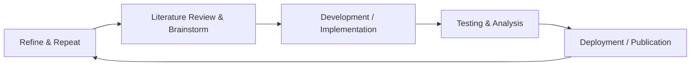

<!-- Banner / Header Section -->

<!-- Title & Subtitle -->
<h2 align="center">Shuvam Banerji Seal</h2>

  <em>Just your everyday Joe with some random skills</em>

<!-- Profile Views & Twitter Badge -->

   
  

---

<!-- Quick Info / Right-aligned GIF -->

  

<!-- About Me Section -->
## 👋 About Me

| Key Point                  | Description                                                                                          |
|---------------------------:|:----------------------------------------------------------------------------------------------------|
| **🔭 Current Focus**       | Working on **Molecular Dynamics**                                                                    |
| **🌱 Learning**            | **LAMMPS**, HPC workflows, advanced **DFT** calculations                                            |
| **👯 Looking to Collaborate** | **ML, Data Science, Molecular Simulations**, **Quantum Chemistry**                                 |
| **🤝 Seeking Help**        | Assistance with advanced **Computational Chemistry** projects                                        |
| **💬 Ask Me**              | Anything about **Quantum Chemistry, Molecular Dynamics, ML, Numerical Analysis**                    |
| **⚡ Fun Fact**            | **I am an Otaku!**                                                                                  |

> **Check out my CV here:** [Shuvam_Banerji_Seal__CV.pdf](https://github.com/Shuvam-Banerji-Seal/My-CV/blob/main/Shuvam_Banerji_Seal__CV.pdf)

---

## ⚙️ Tech Skills

Below is a concise list of tools and technologies I use.  
Click on the badges to explore more about each tech:

### **Molecular / HPC Tools**
 
 

### Programming Languages
 

### Scripting, Markup & Others

### Databases

### Frameworks & Libraries

### Cloud & Hosting

### Data Science / ML

### Additional Tools & Utilities

### Adobe Suite

### Design & Graphics

---
---

## 📝 My Workflow (Mermaid Diagram)

---

<!-- Activity Graph -->

---

## 🌐 Connect with Me
 

---

# 📊 GitHub Stats:

 
 

## 🏆 GitHub Trophies

### ✍️ Random Dev Quote

### 🔝 Top Contributed Repo

### 😂 Random Dev Meme

 

###
