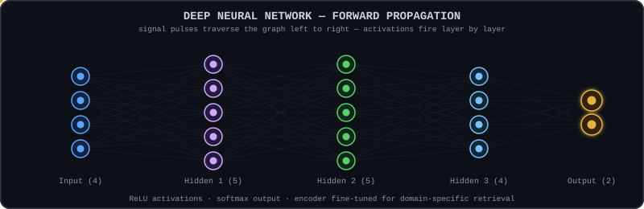
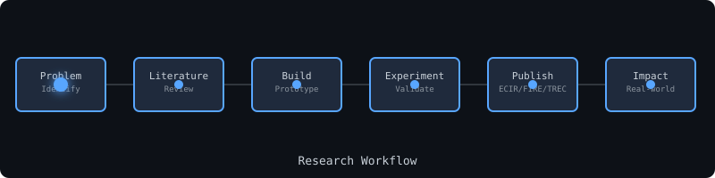
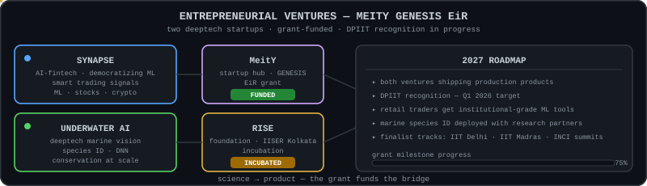
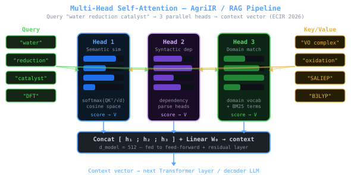
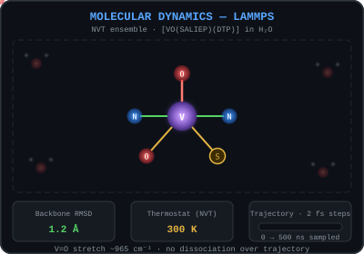
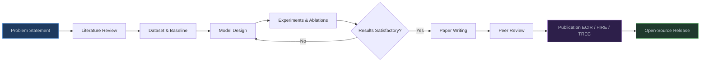

  

  
  
  
  
  

---

<!-- Rotating anime quotes — shuffles through lines from less-known anime -->

  

---

## About

BS-MS student at **Indian Institute of Science Education and Research, Kolkata** (Chemistry Major, Computer Science Minor, CGPA 8.2). My work sits at the intersection of computational chemistry, AI/ML research, and information retrieval. I co-founded two MeitY-funded deeptech startups and have published at ECIR 2026, FIRE 2025, and TREC 2024.

| | |
|---|---|
| **Current Research** | Hybrid RAG architectures, DFT-based catalyst modelling, query reformulation for NLP |
| **Learning** | LAMMPS, HPC workflows, advanced DFT, Agentic AI frameworks |
| **Looking to Collaborate** | ML, Data Science, Molecular Simulations, Quantum Chemistry |
| **Contact** | sbs22ms076@iiserkol.ac.in |

---

## Research — Animated Overviews

  
  

  

  
  

---

## Extended Visualizations

Attention Heads / Transformer Architecture

  

Molecular Orbital Spin Diagram — [VO(SALIEP)(DTP)]

  

Gradient Descent Loss Landscape

  

Molecular Dynamics Simulation — LAMMPS

  

Neural Activation Pulse — Spiking NN

  

Quantum Spin Grid — Ising Model

  

---

## Publications

| Year | Venue | Title |
|------|-------|-------|
| 2026 | **ECIR 2026** (34.5% acceptance) | [AgriIR: A Scalable Framework for Domain-Specific Knowledge Retrieval](https://link.springer.com/ecir) |
| 2025 | **FIRE 2025** | [Hierarchical Opinion Classification using Large Language Models](https://fire.irsi.org.in/fire/2025/home) |
| 2024 | **TREC 2024** (NIST) | [IISERK@ToT_2024: Query Reformulation and Layered Retrieval](https://trec.nist.gov/pubs/trec33/papers/IISER-K.tot.pdf) |
| WIP  | To be submitted | Computational Modeling of [VO(SALIEP)(DTP)] as Water Reducing Catalyst (DFT/B3LYP) |

---

## Entrepreneurial Ventures

| Startup | Domain | Grant | Status |
|---------|--------|-------|--------|
| **[Synapse](https://synapse-iiserk.github.io/)** | AI-Fintech — democratising ML for smart trading | MeitY GENESIS EiR | Funded; DPIIT Q1 2026 |
| **UnderWater AI** | DeepTech — underwater vision for marine species ID | MeitY GENESIS EiR | Funded; DPIIT Q1 2026 |

---

## Tech Skills

### Molecular / HPC

### Languages

### AI / ML / Data

### Frameworks & Tools

---

## GitHub Stats

  
  

  
  

  

  
  

---

## Research Workflow


```mermaid
flowchart LR
    A[Problem Statement] --> B[Literature Review]
    B --> C[Dataset & Baseline]
    C --> D[Model Design]
    D --> E[Experiments & Ablations]
    E --> F{Results Satisfactory?}
    F -- No  --> D
    F -- Yes --> G[Paper Writing]
    G --> H[Peer Review]
    H --> I[Publication ECIR / FIRE / TREC]
    I --> J[Open-Source Release]

    style A fill:#1e3a5f,stroke:#58a6ff,color:#c9d1d9
    style I fill:#2d1f4a,stroke:#d2a8ff,color:#c9d1d9
    style J fill:#1f3a2d,stroke:#56d364,color:#c9d1d9
```

---

## Interactive Lab — Synthesize the Catalyst from the DFT Study

Can you replicate the complex from Shuvam's computational chemistry research? Step through the synthesis:

<strong>Step 1 — Choose your central metal</strong>

> You need a redox-active transition metal capable of oxo-coordination for water reduction.

- 

Select Vanadium (V)

  Excellent choice. Vanadium(IV) oxo-complexes are known water-reduction catalysts.

  - 

Add Salen-type ligand (SALIEP)

    SALIEP provides strong N/O donors that stabilise V(IV). Now choose the co-ligand.

    - 

Add dithiophosphate (DTP)

      **You built [VO(SALIEP)(DTP)]** — the target complex from the DFT/B3LYP study.
      Run Gaussian with the B3LYP functional to compute MO energies and map the water-reduction pathway.
      Correct. This is exactly the compound Shuvam modelled computationally.
    

    - 

Add bipyridine (bpy)

      Interesting coordination, but different from the target. Try dithiophosphate (DTP).
    

  

  - 

Add only H2O as ligand

    Water alone does not form the stable complex needed. Try a stronger donor ligand like SALIEP.
  

- 

Select Iron (Fe)

  Iron forms great catalysts in other systems, but this specific DFT study uses Vanadium. Try again.

---

## Interactive Lab — Build the Hybrid RAG Pipeline (ECIR 2026)

Design the retrieval architecture step by step:

<strong>Step 1 — Choose your retriever</strong>

- 

Dense retrieval only (vector embeddings)

  Handles semantic similarity well, but misses exact keyword matches for rare technical terms. Upgrade?

  - 

Add BM25 sparse retrieval in parallel

    Now you have hybrid retrieval. How do you merge the two ranked lists?

    - 

Reciprocal Rank Fusion (RRF)

      **Perfect.** RRF combines ranked lists without score calibration. Add HyDE (hypothetical document embeddings) for query refinement and wrap in a Streamlit UI — you have replicated the ECIR 2026 / IISER-K intranet system.
    

    - 

Weighted linear score combination

      Works, but requires per-domain calibration. RRF is more robust. Try again.
    

  

- 

BM25 sparse only

  Fast and interpretable, but misses paraphrases. Upgrade to hybrid for better recall.

---

## Connect

---

  

