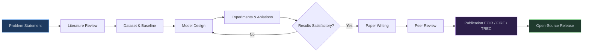

  

  
  
  
  
  

---

<!-- Rotating anime quotes — shuffles through lines from less-known anime -->

  

---

## About

BS-MS student at **Indian Institute of Science Education and Research, Kolkata** (Chemistry Major, Computer Science Minor, CGPA 8.2). My work sits at the intersection of computational chemistry, AI/ML research, and information retrieval. I co-founded two MeitY-funded deeptech startups and have published at ECIR 2026, FIRE 2025, and TREC 2024.

| | |
|---|---|
| **Current Research** | Hybrid RAG architectures, DFT-based catalyst modelling, query reformulation for NLP |
| **Learning** | LAMMPS, HPC workflows, advanced DFT, Agentic AI frameworks |
| **Looking to Collaborate** | ML, Data Science, Molecular Simulations, Quantum Chemistry |
| **Contact** | sbs22ms076@iiserkol.ac.in |

---

## Philosophy

> **First principles, then force fields.** — Every simulation is an argument about reality. I compute to *test* the argument, not to decorate it. If the HOMO–LUMO gap disagrees with the experiment, the gap is not wrong — the model is.

> **Retrieval over memorisation.** — A model that cannot cite its sources is an opinion engine. Whether it is a language model or a spectroscopy reference, the answer must trace back to evidence.

> **Ship the negative result.** — The failed catalyst, the ablation that lost, the retrieval run that underperformed BM25 — these are data. Science compounds only when the null results are public.

---

## Research — Animated Overviews

  

  

  

  

  

---

## Publications

  

| Year | Venue | Title |
|------|-------|-------|
| 2026 | **ECIR 2026** (34.5% acceptance) | [AgriIR: A Scalable Framework for Domain-Specific Knowledge Retrieval](https://link.springer.com/conference/ecir) |
| 2025 | **FIRE 2025** | [Hierarchical Opinion Classification using Large Language Models](https://fire.irsi.org.in/fire/2025/home) |
| 2024 | **TREC 2024** (NIST) | [IISERK@ToT_2024: Query Reformulation and Layered Retrieval](https://trec.nist.gov/pubs/trec33/papers/IISER-K.tot.pdf) |
| WIP  | To be submitted | Computational Modeling of [VO(SALIEP)(DTP)] as Water Reducing Catalyst (DFT/B3LYP) |

---

## Extended Visualizations

<b>Attention Heads / Transformer Architecture</b>

  

<b>Molecular Orbital Spin Diagram — [VO(SALIEP)(DTP)]</b>

  

  
  

  
  

---

## Tech Skills

### Molecular / HPC

### Languages

### AI / ML / Data

### Frameworks & Tools

---

## Interactive Lab — Synthesize the Catalyst from the DFT Study

*Can you replicate the complex from the computational chemistry research? Choose wisely — wrong paths teach too.*

<strong>Step 1 — Choose your central metal</strong>

> You need a redox-active transition metal capable of oxo-coordination for water reduction.

- 

Select Vanadium (V)

  Correct instinct. Vanadium(IV) oxo-complexes are known water-reduction catalysts — the d¹ electron gives you EPR handle too.

  - 

Add Salen-type ligand (SALIEP)

    SALIEP provides strong N/O donors that stabilise V(IV). Now choose the co-ligand.

    - 

Add dithiophosphate (DTP)

      **You built [VO(SALIEP)(DTP)]** — the exact target complex from the DFT/B3LYP study.
      Run Gaussian with B3LYP/6-311G(d,p), compute MO energies, map the water-reduction pathway.
      The V=O stretch should land near 965 cm⁻¹ — if it does, your geometry converged.
    

    - 

Add bipyridine (bpy)

      Interesting coordination — but bpy makes the complex too inert for proton-coupled electron transfer here. Swap in dithiophosphate (DTP).
    

  

  - 

Add only H₂O as ligand

    Water alone will not chelate stably — it exchanges too fast. Try a stronger donor like SALIEP.
  

- 

Select Iron (Fe)

  Iron catalyses plenty of chemistry — but this specific DFT study uses Vanadium. Try again.

- 

Select Zinc (Zn)

  d¹⁰ — diamagnetic, redox-silent. No unpaired electron, no EPR signal, no water reduction here. Pick a metal with available d-electrons.

---

## Interactive Lab — Build the Hybrid RAG Pipeline (ECIR 2026)

*Design the retrieval architecture step by step — same decisions I made for the IISER-K intranet system.*

<strong>Step 1 — Choose your retriever</strong>

- 

Dense retrieval only (vector embeddings)

  Handles semantic similarity well, but misses exact keyword matches for rare technical terms. Upgrade?

  - 

Add BM25 sparse retrieval in parallel

    Now you have hybrid retrieval. How do you merge the two ranked lists?

    - 

Reciprocal Rank Fusion (RRF)

      **Perfect.** RRF combines ranked lists without score calibration. Add HyDE (hypothetical document embeddings) for query refinement and wrap in a Streamlit UI — you have replicated the ECIR 2026 / IISER-K intranet system.
    

    - 

Weighted linear score combination

      Works, but requires per-domain score calibration — brittle across corpora. RRF is more robust. Try again.
    

  

- 

BM25 sparse only

  Fast and interpretable, but misses paraphrases. Upgrade to hybrid for better recall.

- 

Fine-tune a cross-encoder re-ranker on 50 labelled queries

  Legitimate architecture — but with 50 labels you will overfit in an afternoon. Hybrid + RRF gets you further with zero labels. Try the label-free path first.

---

## Interactive Lab — Run the MD Simulation (LAMMPS)

*Solvate the vanadium complex and keep it intact for 500 ns. Three choices, one stable trajectory.*

<strong>Step 1 — Pick the ensemble</strong>

- 

NVT (fixed volume, thermostat only)

  Stable and simple — but with fixed volume you cannot model the solvent density change as the complex relaxes. Fine for a first equilibration, though. Proceed.

  - 

Thermostat: Nosé–Hoover

    Smooth, deterministic, canonical ensemble. Now the integration timestep:

    - 

2 fs with constrained bonds (SHAKE)

      **Stable trajectory.** Constraints remove the fast X–H vibrations, 2 fs resolves the V=O stretch, and over 500 ns the RMSD plateaus near 1.2 Å — complex intact, no dissociation. This is the production setup.
    

    - 

5 fs bare (no constraints)

      Blown up. The O–H stretch oscillates at ~10 fs period — a 5 fs step integrates it as energy gain and your simulation detonates within picoseconds. Constrain bonds and drop to 2 fs.
    

  

  - 

Thermostat: direct velocity rescaling every step

    It will hold the temperature — but it distorts dynamics and gives wrong fluctuation statistics. Nosé–Hoover samples the canonical ensemble properly.
  

- 

NVE (no thermostat)

  Pure Newtonian dynamics — beautiful, but any drift from the equilibrated state never gets corrected. Use NVT for production.

---

## GitHub Stats

> Every stat service below was verified alive (HTTP 200, valid SVG) at embed time. Dead endpoints — github-readme-stats (deployment paused), profile-trophy and contributor-stats (disabled), streak-stats herokuapp (shut down) — were removed in the v2 redesign rather than left rendering error images.

  
  

  
  

  

  

---

## Research Workflow

```mermaid
flowchart LR
    A[Problem Statement] --> B[Literature Review]
    B --> C[Dataset & Baseline]
    C --> D[Model Design]
    D --> E[Experiments & Ablations]
    E --> F{Results Satisfactory?}
    F -- No  --> D
    F -- Yes --> G[Paper Writing]
    G --> H[Peer Review]
    H --> I[Publication ECIR / FIRE / TREC]
    I --> J[Open-Source Release]

    style A fill:#1e3a5f,stroke:#58a6ff,color:#c9d1d9
    style I fill:#2d1f4a,stroke:#d2a8ff,color:#c9d1d9
    style J fill:#1f3a2d,stroke:#56d364,color:#c9d1d9
```

---

## Connect

---

  

