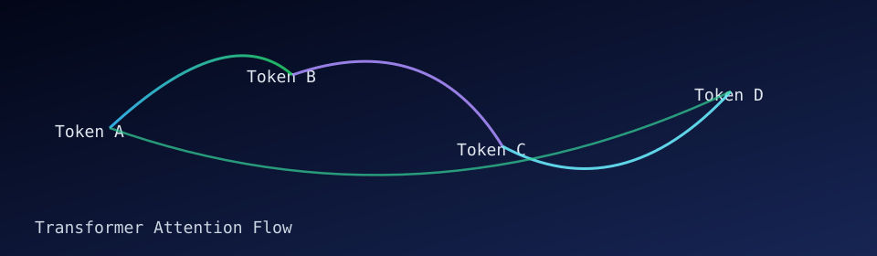
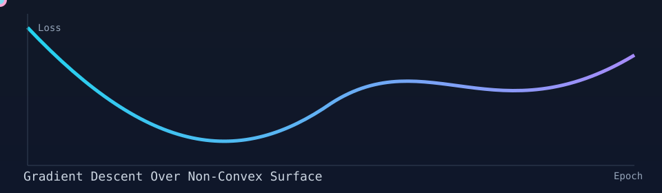
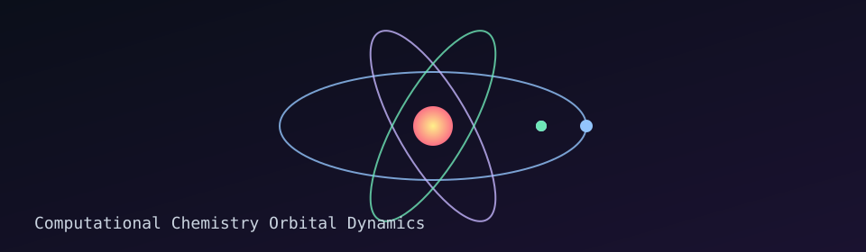
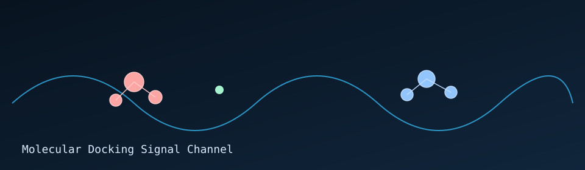
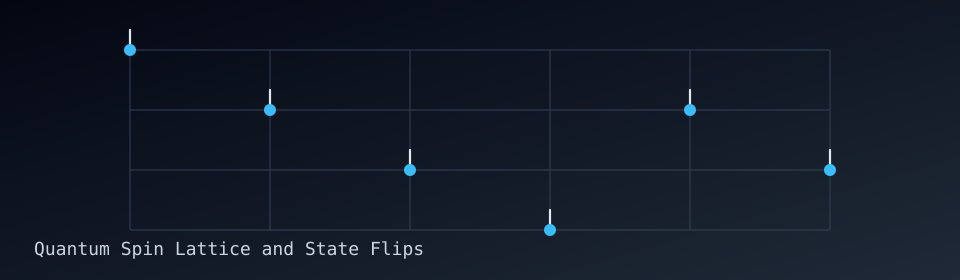

<h1 align="center">Shuvam Banerji Seal</h1>

Computational Chemistry • AI/ML Research • Information Retrieval • DeepTech Builder

  <a href="https://shuvam-banerji-seal.github.io/">Website</a> |
  <a href="https://github.com/Shuvam-Banerji-Seal/My-CV/blob/main/Shuvam_Banerji_Seal_CV.pdf">CV PDF</a> |
  <a href="https://www.linkedin.com/in/mastersbs">LinkedIn</a> |
  <a href="mailto:sbs22ms076@iiserkol.ac.in">Email</a>

  

---

## Overview

I am a BS-MS student at IISER Kolkata (Chemistry major, Computer Science minor), building systems at the intersection of computational chemistry, information retrieval, and AI engineering.

Current focus areas:
- Verifiable retrieval-augmented generation and information retrieval for scientific domains
- Computational chemistry workflows and molecular simulation tooling
- Agentic AI systems and data pipelines for research and startup products

Recent outcomes:
- ECIR 2026 accepted: AgriIR (domain-specific retrieval framework)
- FIRE 2025 accepted: Hierarchical opinion classification with LLMs
- TREC 2024 paper: query reformulation and layered retrieval
- Co-founder: Synapse (AI-fintech) and UnderWater AI (deeptech), both MeitY GENESIS funded

---

## Animated Lab

### Neural and Retrieval Systems

### Computational Chemistry and Physics

---

## Core Stack

### Languages

### ML and Data

### Retrieval and App Engineering

### Computational Chemistry and Systems

---

## GitHub Analytics

  
  

  
  

  

  

---

## Mini Games (Markdown + SVG)

### 1) Gradient Descent Guess
Use the curve below and guess where convergence is likely the fastest.

Options:
- A: very early high-loss region
- B: mid-path around first valley
- C: near stable minimum basin

  
Answer

  C is usually best for final convergence stability; B can be useful for faster exploration.

### 2) Neural Path Maze
Start from `Input` and choose your route:
- Route A: Input -> Dense -> Dense -> Output
- Route B: Input -> Attention -> Retrieval -> Output
- Route C: Input -> Random Jump -> Output

  
Scoring Guide

  Route B scores highest for your profile because it reflects retrieval-augmented and transformer-based work.

### 3) Molecular Stability Challenge
Inspect orbital and docking animations and pick the stronger stability signal:
- Option A: symmetric orbital behavior with smooth transitions
- Option B: abrupt oscillations and fragmented motion

  
Answer

  Option A generally indicates a more stable pattern under this simplified visual heuristic.

---

## Selected Links

- Website: https://shuvam-banerji-seal.github.io/
- CV repository: https://github.com/Shuvam-Banerji-Seal/My-CV
- CV PDF: https://github.com/Shuvam-Banerji-Seal/My-CV/blob/main/Shuvam_Banerji_Seal_CV.pdf
- Research profile: https://orcid.org/0009-0000-0714-569X

---

  

